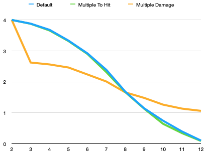
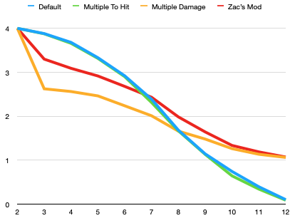
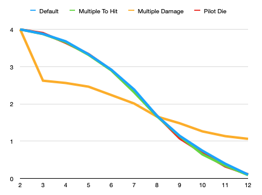

## Lies, Damn lies and statistics

Alpha Strike has three different models of damage allocation. The default system applies the full damage to the target if the to-hit roll is equal to or greater than the target number. So if a model needs a 9+ to hit and does four damage at that range then it applies all four points when a hit is rolled.

The second method, the *multiple damage method*, requires the player to roll a dice for each point of damage when a hit is registered. So if the 9+ from the earlier example was rolled then the player would roll four dice and get a point of damage for each D6 roll of 3+. There is a minimum of 1 point of damage using this method.

The third method, the *multiple hit method,* requires the player to make multiple to-hit rolls. So if you needed a 9+ to hit and did four damage at that range then you would roll four pairs of dice and each 9+ would give you a point of damage [^1].

Many people use the multiple hit method when playing Alpha Strike. When I was watching videos with battles using this method my initial concern was that it would give more damage (on average) for higher to-hit values. So a damage result of 4 would, again on average, result in more damage than doing a single to-hit roll.

When I played my solo Alpha Strike game I used the multiple damage method but my experience of that system was that I was often having to rely on the minimum damage since I would roll multiple 2s or less when applying damage. 

So I did what every geek without a statistics background does and wrote out some code to actually make 10,000 to hit rolls for each target number and see how much damage each model applies [^2].

| Roll | Default | Multiple To Hit | Multiple Damage |
| :--- | :-----: | :-------------: | :-------------: |
| 2    |    4    |        4        |        4        |
| 3    |  3.88   |      3.875      |      2.624      |
| 4    |  3.68   |      3.658      |      2.562      |
| 5    |  3.332  |      3.316      |      2.463      |
| 6    |  2.92   |       2.9       |      2.238      |
| 7    |  2.388  |      2.313      |      2.011      |
| 8    |  1.684  |      1.668      |      1.661      |
| 9    |  1.144  |      1.132      |      1.481      |
| 10   |  0.744  |      0.644      |      1.263      |
| 11   |  0.396  |      0.343      |      1.135      |
| 12   |  0.104  |      0.09       |      1.063      |

Now it shouldn't surprise you that the default method and the Multiple to Hit method actually result in the exact same damage. When playing, the Multiple to Hit method might seem to give you better results but taken over a large number of rolls the results are exacting the same since you are averaging the results out. The Multiple to Hit method just gives you more rolls but statistically speaking that makes no difference. 

What surprised me, and it shouldn't if I had thought about it, was how variant to the results were for the Multiple Damage method. First off, the method gives you a minimum 1 point of damage no matter what. Secondly, 30% of your damage is going to miss since it requires a 3+ roll on a D6 to be applied to the target. That additional 30% causes the method to give much lower damage results for more 'certain' hits but additional damage for less 'certain' hits. It is much more apparent in a chart. 

All the methods converge when needing a 8+ to hit but the Multiple Damage method gives skewed results for any other value.

A simple fix for this would be to lower the threshold for the damage application making it a 2+ instead of a 3+. Doing that does make the damage move closer to the other two methods but it is still off.

And the raw data

| Roll | Default | Multiple To Hit | Multiple Damage | 2+ mod |
| :--- | :-----: | :-------------: | :-------------: | :----: |
| 2    |    4    |        4        |        4        |   4    |
| 3    |  3.88   |      3.875      |      2.624      | 3.299  |
| 4    |  3.68   |      3.658      |      2.562      |  3.09  |
| 5    |  3.332  |      3.316      |      2.463      | 2.916  |
| 6    |  2.92   |       2.9       |      2.238      | 2.679  |
| 7    |  2.388  |      2.313      |      2.011      | 2.432  |
| 8    |  1.684  |      1.668      |      1.661      | 1.985  |
| 9    |  1.144  |      1.132      |      1.481      | 1.643  |
| 10   |  0.744  |      0.644      |      1.263      | 1.336  |
| 11   |  0.396  |      0.343      |      1.135      | 1.189  |
| 12   |  0.104  |      0.09       |      1.063      | 1.072  |

Now the intent of the two alternate damage application methods is to give the game a less deterministic feel and also to stop heavier mechs from instantly killing smaller mechs. Or at least giving them a chance to potentially survive. If a mech deals 4 points of damage at a range band a mech like a Commando is going to get eliminated if it gets hit unless you try to randomize the application of that damage. 

This is probably a good idea and if you want to do this in your games then I would suggest using the Multiple to Hit method and not the Multiple Damage method. Multiple Damage seems to reward speculative hits of 9+ and penalize more certain to hit rolls of 7 or less. 

The fellows at the <a href="http://dfawargaming.com/index.html" target="_blank" rel="noopener">Death From Above</a> site have popularized a method called Pilot Die. In this damage system you roll a pilot die (which is visually distinct) and then a number of dice equal to the damage for the mech. Each die is then added to the pilot die and compared to the to-hit value.

There has been some discussion about whether this method would skew the damage results. Statistics is odd in that elements that seem as if they would have an impact often don't. Which is the reason for this article. My own suspicion was that the pilot die would cause damage to not follow the curve of the other methods. Running some code proved this to not be the case. 

| Roll | Default | Multiple To Hit | Multiple Damage | Pilot Die |
| :--- | :-----: | :-------------: | :-------------: | :-------: |
| 2    |    4    |        4        |        4        |     4     |
| 3    |  3.88   |      3.875      |      2.624      |   3.901   |
| 4    |  3.68   |      3.658      |      2.562      |   3.64    |
| 5    |  3.332  |      3.316      |      2.463      |   3.338   |
| 6    |  2.92   |       2.9       |      2.238      |   2.909   |
| 7    |  2.388  |      2.313      |      2.011      |   2.325   |
| 8    |  1.684  |      1.668      |      1.661      |   1.688   |
| 9    |  1.144  |      1.132      |      1.481      |   1.075   |
| 10   |  0.744  |      0.644      |      1.263      |   0.686   |
| 11   |  0.396  |      0.343      |      1.135      |   0.322   |
| 12   |  0.104  |      0.09       |      1.063      |   0.111   |

In fact the Pilot Die method follows the other curve so closely that you can almost not see it. So it appears as if the Pilot Die method is a quick, and statistically reliable, method to use to speed up your dice rolls in Alpha Strike. It is true that individual rolls using the Pilot Die method will often cluster and make the system look as if it is a failure. Applied over a significant number of die rolls though it does average out.

[^1]: How to determine which dice are part of a paired to-hit roll is a challenge left to the reader.
[^2]: Yes, I realise that I can just run a stats package like R to do this. 

