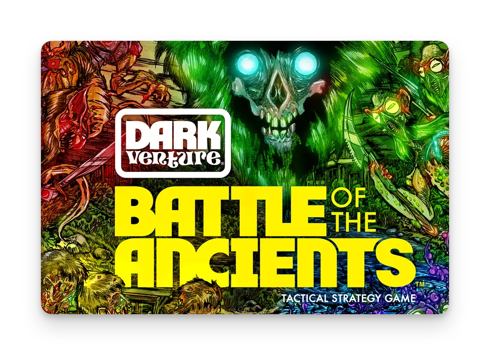
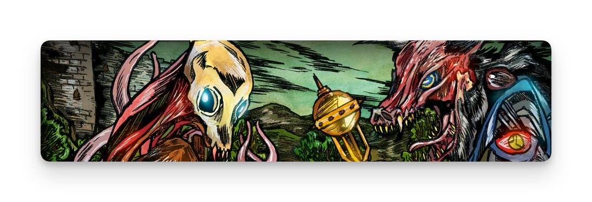
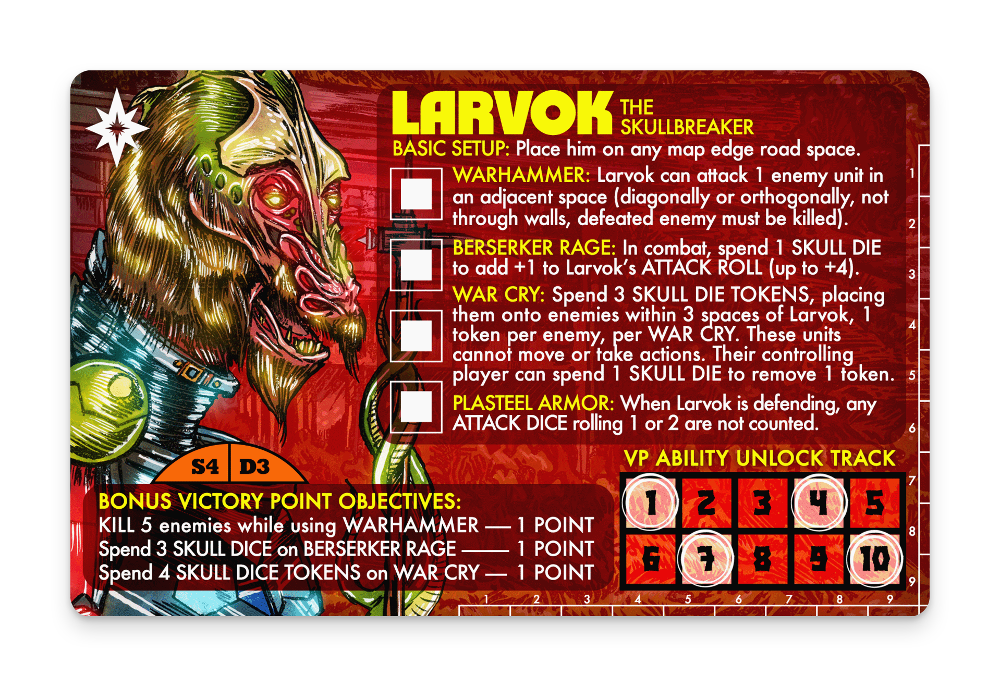
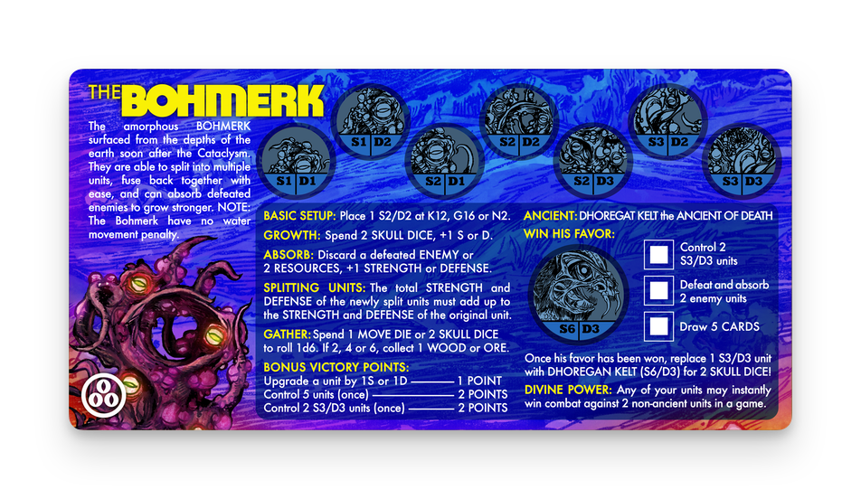
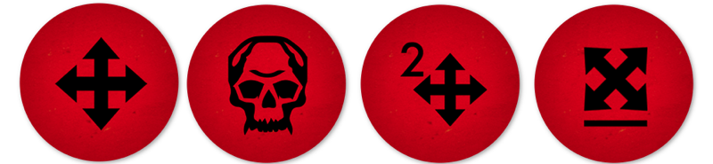
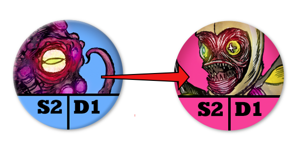
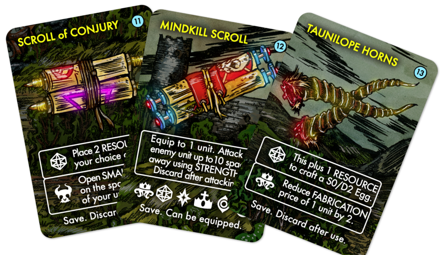
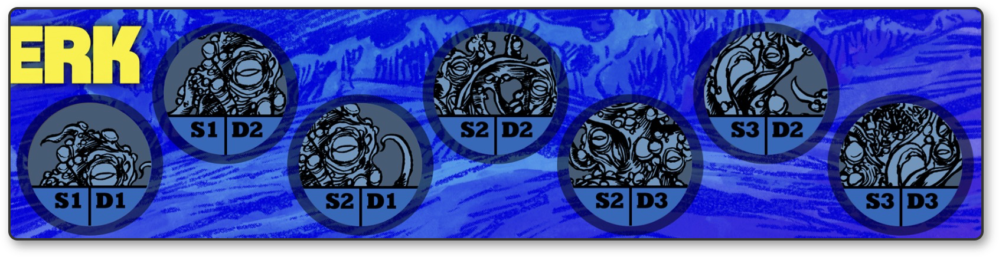
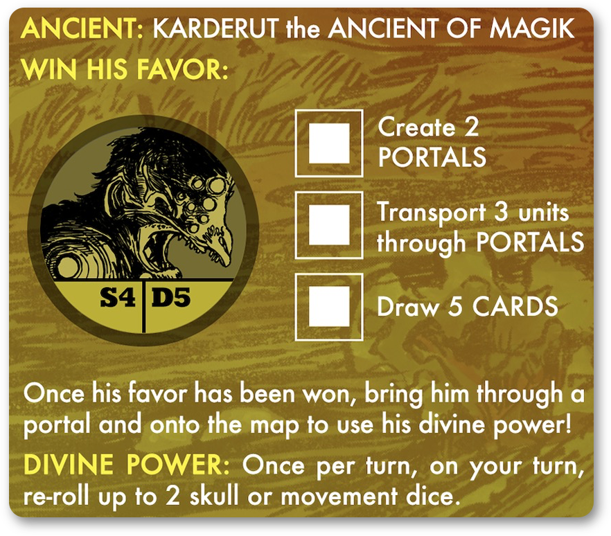

[Dark Venture: Battle of the Ancients](https://boardgamegeek.com/boardgame/298163/dark-venture-battle-of-the-ancients) is a board game produced by [Guilded Skull Games](https://gildedskull.com). Guilded Skull is the nom de entreprise for Rob Lemon an illustrator and game designer from New York. Rob has produced a video game, [Galactic Keep](https://store.steampowered.com/app/587440/Galactic_Keep/) [^2], and a previous card game called [Dark Venture](https://gildedskull.com/darkventure/index.html). Dark Venture: Battle of the Ancients is a followup game to Dark Venture and expands his post-apocalyptic Darkgrange setting with a new game experience that includes solo, co-operative and competitive game modes.

What follows is an overview of the game and how it plays. This isn't meant as a review. There are some good reviews as well as gameplay videos that you can check out on [the game's BGG page](https://boardgamegeek.com/boardgame/298163/dark-venture-battle-of-the-ancients/videos/all). 

_A small note before I continue. Dark Venture: Battle of the Ancients is from a small publisher and is currently not in print. It was funded via [a Kickstarter project](https://www.kickstarter.com/projects/960192600/dark-venture-battle-of-the-ancients) and is not available for sale from the publisher. You may be able to find copies of the game on the secondary market or from online resellers. I was lucky enough to pick up a second hand copy of the game. If you don't want to read about a game you may not be able to purchase then accept my apologies and check out [this picture of cute puppies](https://www.fanpop.com/clubs/cute-puppies/images/41540150/title/playful-puppies-photo) instead._

## What is Darkgrange

It is difficult to describe Darkgrange because it has very few modern reference points. Gamers of a certain vintage will remember the [Thundarr the Barbarian](https://en.wikipedia.org/wiki/Thundarr_the_Barbarian) animated series or the [Kamandi comic book](https://en.wikipedia.org/wiki/Kamandi) produced by DC Comics or even the [Empire of the East books](https://en.wikipedia.org/wiki/Empire_of_the_East_series). It also contain elements of RPGs such as [Metamorphosis Alpha](https://en.wikipedia.org/wiki/Metamorphosis_Alpha), [Gamma World](https://en.wikipedia.org/wiki/Gamma_World), [Mutant Crawl Classics](https://goodman-games.com/store/mutant-crawl-classics/) and [Hyperborea](https://www.hyperborea.tv). More recent titles that have the same there are titles such as [Neuroshima Hex](https://boardgamegeek.com/boardgame/21241/neuroshima-hex-30) [^4], [51st State](https://boardgamegeek.com/boardgame/73369/51st-state) and [Neuroshima Convoy](https://boardgamegeek.com/boardgame/120605/neuroshima-convoy) [^3].

The 'New Earth' setting from the Thundarr animated series is described as containing "savagery, super-science, and sorcery" and this is a good summation of some of the themes in Battle of the Ancients. The genre is also sometimes referred to as "weird super-science". Darkgrange has fewer 'swords' than many examples of the genre and might be more accurately described as 'gristle and super-science' as the denizens of the Dark Venture world are more likely to have hooks, claws and beaks as opposed to swords, spears and pikes.

### The game factions

The Dark Venture series has several different factions but these tend to be more of a thematic sketch of the options available to units and not political or organizational structures [^1]. When playing a scenario in Battle of the Ancients you can choose from:

* **Orpal** - _Humans afflicted by a parasitic virus that use dimensional rifts to transport violent, unthinking minions to Darkgrange_.
* **Varpen** - _An aggressive race of creatures that mutate themselves into more powerful forms._
* **Dhargon** - _A peaceful alien species that are stripping Darkgrange of resources to lay and hatch their eggs [^9]._
* **Bohmark** - _Shapeshifting viral creatures that absorb their enemies to make themselves more powerful._
* **Alderkang** - _Delok the scientist uses his Fabricator to extract the genetic data of nearby creatures to build an army to bring back the deposed, and dead, Alderkang._

In addition there are two expansions for Battle of the Ancients that add several new factions.

* **Beasts** - _Literal beasts. The various mutated and warped animals that inhabit the Darkgrange. Including Undead Horses!_
* **Eggmen** - _Psychically connected by the Egg King these units work in sync and can be upgraded to Warlocks to cast spells. Their connection allows for quick communication between units._
* **Kingsguard** - _The guards of the Forgone King who have a special deck of equipment provided for them by their liege. A mix of soldiers and Heroes._

Added to this is a set of nine heroes that can be used to play the game in place of one of the factions. 

## The game

Battle of the Ancients is described as a "tactical strategy game" for one to four players [^5]. The game is played on a map with a 16 x 16 grid that demarcates the play area defined horizontally from A to P and vertically from 1 to 16. There are two maps in the core game and a third in the Kingsguard expansion. There are also several die-cut overlays that can be added to the maps for new scenarios in the two expansions. 

Battle of the Ancients is a modern version of games such as the classic Avalon Hill title [Magic Realm](https://boardgamegeek.com/boardgame/22/magic-realm). In this case it trades the extensive rules and complex combat system for a more focused set of rules that let you concentrate on the core experience of exploring the world of Darkgrange or just having a quick skirmish games with your friends. 

### Scenarios

A session of Battle of the Ancients can be played in several different ways. There are individual scenarios that can be played one their own or as part of a campaign as well as adventure scenarios and victory scenarios. Adventure scenarios are open-ended story games where players explore the map and can interact with event tokens to create new, potentially branching, events in the game. Victory scenarios pit players against one another using the basic setup conditions on each faction's mat. Players get VPs as defined in the scenario but also bonus VPs listed on the faction mat. Adventure scenarios are exploratory with the players deciding how to play each session and the victory scenarios are competitive skirmish games. 

The faction mat displays each of the different unit types available as well as the basic setup (for victory games), the special actions available to the faction and bonus victory points the faction can gain in scenarios. In addition it details the actions needed to bring out the Ancient unit. More on the Ancients in a bit. 

### Automated Enemies

One of the core elements of the game is that there are small, seven to nine card, decks that provide a solo bot for each faction [^6]. These are used when you play solo games (obviously) but also when you play a co-operative scenario. You can even include them in a victory game with friends if you want to add some complications to the game. The cards in each deck are numbered. When it is the automated enemy's turn you work through each card in order to determine what actions the enemy takes. It is a quick process and it allows for each faction, or hero, to have distinct actions that fit the theme, and abilities, of the faction. It sounds as if it would be cumbersome but once you have gone through the process once it is immediately obvious what happens with each card making subsequent turns quicker. 

### Player turns

The actions that each player can do in their turn are determined, and limited, by the results of six red action dice [^7]. These are rolled at the beginning of each player's turn. The dice results are one orthogonal move, skull, two orthogonal moves and one diagonal move. These results are spent to move a player's units and to activate the faction's special abilities. If you check out the Bohmerk mat above you can see that the Growth ability requires a player to spend two Skull dice. 

In a turn a player can move units by playing the movement dice, activate abilities, engage in combat with other units in the same square and draw action or item cards if a unit is in the same square as an action or item token. Each player has a 'genetic memory card' that they can use to store up to three unused dice as action tokens. This is quite handy as some abilities require a specific number of dice to be used.

### Combat

Combat in Battle of the Ancients is quite simple.

Each unit in the game has a **S**trength and a **D**efence rating. These indicate the number of dice the unit provides in combat. In this example, the attacking Bohmerk unit would roll two attack dice and the Eggman would roll one defence dice.  The dice are totaled and if the attacker exceeds the defenders result it wins. Otherwise the defender survives the encounter. If half or more of the defender's dice are 6s then they can counterattack. Units also have the option of grouping their attack strength to take on one or more defenders. 

Some factions and heroes have options available to them if they succeed in combat. Delok of the Alderkang can extract the DNA from dead opponents to use to create that same type of unit in his Fabricator. The Bohmerk can absorb their opponents at increase their stats. The Orpal can sacrifice them to open warp portals. You can remove your enemies from the game and in some cases use them to help further your objections in a horrible and grim fashion.

### Expanding the game

Battle of the Ancients is a rules-light game but expands the gameplay options by providing players with asymmetric factions as well as a large number of items and events that can occur during the game. Each scenario has item and event tokens that are positioned on the map and players can interact with them to get armour and weapons, potential allies or additional actions to do things like build walls, re-roll combat dice or get additional action tokens. Beasts can pop up into the map and be claimed by players to help in combat or you can get an additional unit as reinforcements. 

There are enough of each type of card that it is unusual to get the same ones in subsequent games. Cards can also be saved for later use or sometimes discarded to power actions or trigger events. 

### Faction differences

What truly gives the game its unique character are the factions and how their gameplay options change the way each player, or automated enemy, approaches the game. Delok and his Alderkang allies are looking for prisoners to feed to the Fabricator. The Bohmerk can split larger units into less powerful but more plentiful units. The Dhargon are harvesting resources to try to hatch their eggs but also to build walls and fences to help keep their enemies at arm's length. 

Each faction also has different numbers of and types of units. The Dhargon have three (two if you don't count the **S0D1** Egg) while the Bohmerk have seven including an **S3D3** behemoth. 

Some of these units can also have special status in the game. The Orpal's **S2D3** unit is called the *Gatemaster* and is required to open rifts. The Kingsguard *Huntsman* can be equipped with bows and the Eggmen can create a *Wizard* they can use to cast spells.

There is a commonality amongst the factions but they all have unique actions as well as ways of gaining victory points in victory scenarios. The Dhargon can rack up a huge victory scenario score and never interact with any of their opponents. The Orpal are looking to sacrifice prisoners to open large rifts. The Bohmerk want to build up their forces and try to get their **S3D3** unit on the table. 

In general, the primary differences between factions stems from their special abilities, the way that they produce units and the way that they upgrade units.

#### Ancients

Each faction has a special unit, called an Ancient [^8], that they can attempt to bring to the map by gaining the favour of their Ancient by accomplishing three goals. Each faction has two specific goals and the third is to draw five item or event cards [^10]. 

Each Ancient, except for the Beast's Ancient, has a Divine Power that can be used during your turn. In addition they are also monsters in combat. 

## Putting it all together

There is no individual component of Battle of the Ancients that is difficult to play or understand. All of the different factions could be a bit too much to take in at one time but the game has a series of introductory scenarios that walk you through the game's core rules and then introduces each faction. The appeal of the game comes from several factors which all tie together to make a very fun game.

### Theme

I suspect that the artwork and theme might put some off but the Darkgrange is a crazy mix of swords and sorcery and mutant post-apocalyptic madness. Darkgrange, and the factions themselves, are not expanded upon in detail but instead you get a tantalizing gloss of characters and themes that implies a wider background. Enough to hang your imagination on but not so much that you get drowned in fluff. It is similar to older games like Dark Emperor, Magic Realms and others where the excitement came from the game itself with the background being more inspirational than expository. 

The artwork is really what builds the sense of the game universe. It is chaotic and somewhat nightmarish but also continues the theme of implying a universe instead of explaining it. 

### Asymmetry

I think that multi-player games benefit from a level of asymmetry in the factions or units in a game. Games such as [Root](https://boardgamegeek.com/boardgame/237182/root) go too far with this and give the players, essentially, four different games within a game. Battle of the Ancients gives players asymmetrical options built around a shared structure. Playing the Orpal after a game using the Bohmerk won't require you to rethink the way that you play but just to change your goals and the actions you use to get there. 

### Game Modes

The number of ways that you can play Battle of the Ancients is incredible. Co-op, solo and competitive games are all possible. There are stand-alone scenario as well as campaign and adventures modes. And you can choose to play some modes using Heroes instead of a faction if you want to create a 'one hero against the wastelands' experience. There are many games that only get played in particular group settings. Some games only play well with 3-4 players. Maybe your group doesn't like competitive games? Some need larger groups. Battle of the Ancients can be played in a dizzying number of different configurations meaning that there is almost no reason why it can't be played regardless of your group's size or needs.

### Design

Most people don't focus on the visual design of games as much as I do. It is a side-effect of working as a visual designer. Good visual design can make or break games. [Voidfall](https://boardgamegeek.com/boardgame/337627/voidfall), as an example, would be very difficult to play without the excellent work done on the visual language of the icons. Vuca Simulations make games that that I would never play [due to the complexity of them](https://vucasims.com/collections/available-games/products/1914-nach-paris-breakthrough-series-1) but which I would love to own simply because of how beautiful they look. 

The design in Battle of the Ancients is deceptively simple and calls back to games from the late 70s and early 80s. There is something quite "British" about the design. Some elements, such as the faction mats, are quite busy but still are functional and pleasant to look at. And how the game is able to use all-caps throughout the design without destroying the readability is beyond me. It all works though and the design helps to carry the visual and story themes without being overdone. 

[^1]: The exception being the Kingsguard who are part of a feudal system that rules some parts of the Darkgrange.

[^2]: Rob Lemon says "There are a few references to Galactic Keep in Dark Venture and Battle of the Ancients (there are more references in Dark Venture). The games do exist in the same universe (possibly in a different time) but this is only implied, never specifically defined. Yet.".

[^3]: All from [Portal Games](https://shopportalgames.com).

[^4]: A favourite of mine.

[^5]: One to six if you have the two expansions.

[^6]: As well as a deck for the Heroes. 

[^7]: There are square dice but I only have art for the symbols themselves. Fear not. 
[^8]: Hence the name of the game.
[^9]: According to the background in the Dark Venture card game, the true goal of the Dhargon is to repair their spacecraft to return to their home planet. 

[^10]: The Kingsguard has 'Draw 8 cards' as their goal and the Beasts don’t have an objective to draw cards to summon their Ancient.

