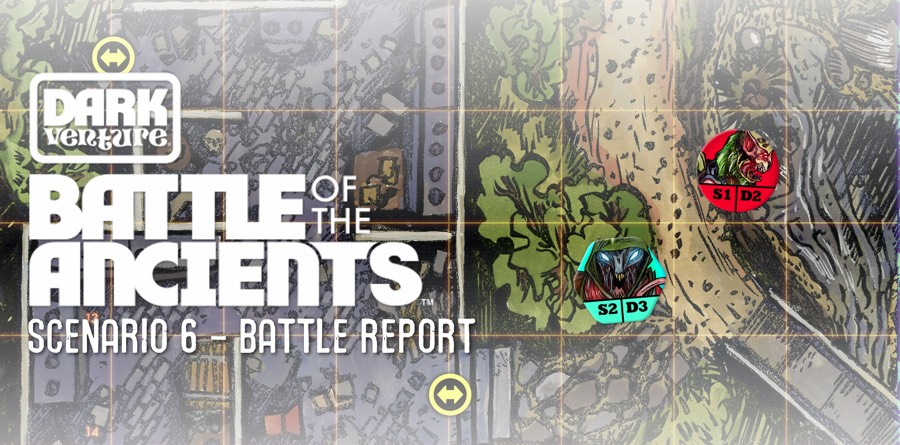
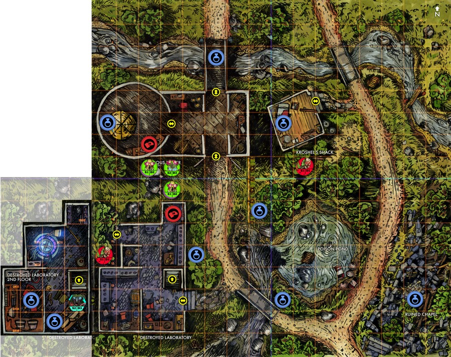

## Getting started

For my first _Battle of the Ancients_ battle report I have decided to play Scenario 6 from Book 2 titled "An Alliance". The scenario pits the Alderkang and Dhargon against the Varpen. Book 2, Scenarios A, from the _Battle of the Ancients_ core game has a series of scenarios that are linked with a continuing narrative. In it Delok, the Alderkang scientist, is looking for a mystic power source to enable them to revive the dead Alderkang. Delok has been hiding, and working, in the Destroyed Laboratory and has noticed a group of Dhargon foragers in the area. A troop of Varpen have been tracking Delok and scouting the area and have decided to attack.

### Setup

The scenario is the first to use one of the die-cut map expansions. In this case it is the second floor of the Destroyed Laboratory. Delok starts on the second floor but without the Fabricator. 

To the north of the Laboratory is a Dhargon party that is scouring the area for resources. Two of the Dhargon are carrying Ore resource tokens. Two groups of Varpen start on the board at A12 and K8. 

### Objectives

### Strategy

## Turn 1

### Varpen turn

One S1/D1 at K8 is upgraded to an S1/D2. One S1/D1 at A12 is upgraded to an S1/D2. No movement. Four cards which are spent to spawn. Success with S1/D1 at A4. Spawn phase succeeds with a second S1/D1 at A4.

### Alderkang.

 Action roll: ZSkull, 2 x Diag, 2 x Orth, 1 x double Orth

Delok activates and moves to 2C15 and then 2B14 with two diag dice. Picks up Torgneeer Bezoar (43) and Scroll of Flight (46). Uses double orth to move to 2A13 and then uses Skull and 2 x Orth to build the Fabricator. 

### Dhargon

