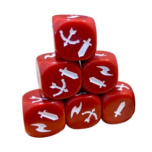
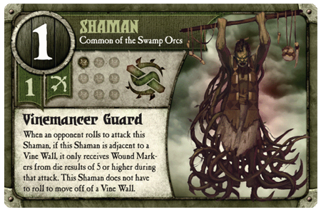
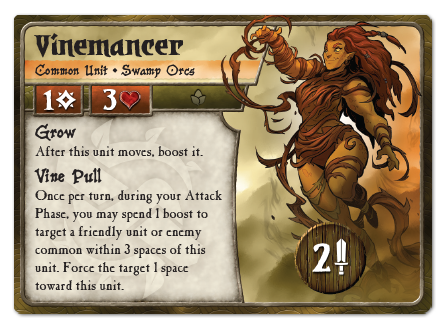
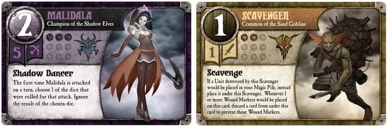
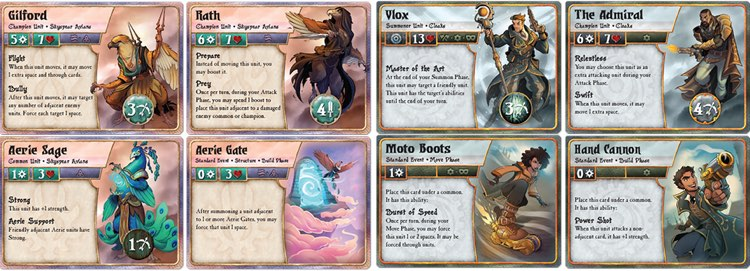
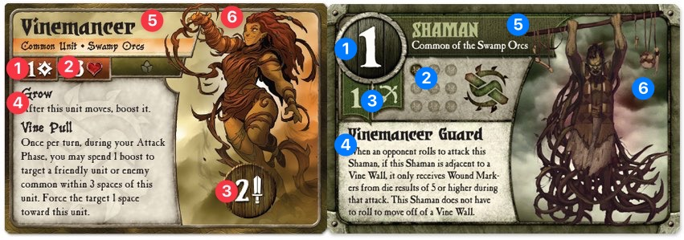
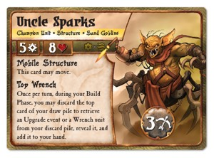

There are two things that I really like. Card games and strategy games that involve fantasy monsters and magicians fighting. In years past, I used to play a game called Summoner Wars [^1], specifically the [Master Set](https://boardgamegeek.com/boardgame/93260/summoner-wars-master-set) released in 2011, and bought most of the expansions that [Plaid Hat Games](https://www.plaidhatgames.com/) released for it. It was a fun game but I eventually stopped playing it. The main problem with the game was the scaling difficulty that left it difficult to find players. 

After we got settled into the new house and I found out where all the local games stores were I came across a copy of the new [second edition of _Summoner Wars_](https://www.plaidhatgames.com/board-games/summoner-wars/). I was hesitant to pick the game up again so I checked out the Plaid Hat Games website and read through a few of the [preview articles](https://www.plaidhatgames.com/news/2023/05/15/high-elves-preview-1/) for the new edition. There were enough changes evident from reading those pieces that I decided to pick the new edition up.

This isn't a review of the game, you can probably find any number of those online, but a discussion of what has changed in the rules and design and why I think those changes have made for a better game. 

## What changed?

### Damage much?

The new game uses custom D6s to determine combat results. Each face will have from one to three symbols - either a sword, bow or lightning bolt. A sword will act as a hit for a melee combat, a bow for ranged combat and the lightning bolts have varying effects depending on the unit and any events or spells that are in play.  There are only five faces with swords, four with bows and two have lightning bolts. In the previous version of the game you used standard D6s and all combat hit on a roll of a 3+ on a die.

In the first edition combat was very random. Units with low combat values would often not do any damage and even units with high combat stats could miss with four or five dice. The standard units in the game had low combat ratings and low hit point values and so would do little damage and die quickly. Champions would have a lot of hit points and high combat values and would mow down standard units and were only really threatened by other champions. 

The entire field could be cleared by one or two champions and this made the game feel like a race to deploy your champions. 

Units in the game now have more hit points but they also hit more consistently. You can do some quick mental math when you plan your turn and while you can still be surprised by combat [^2] it isn't the RNG nightmare that the first edition could turn into.

Now when a unit or champion gets wiped out you see why and you can learn from the event. There really isn't anything to learn from your opponent just rolling a statistically unlikely number of 6s.

### Turn structure

The first version of _Summoner Wars_ had a fairly simple turn structure.

1. Draw
2. Summon
3. Events
4. Movement
5. Attack
6. Build Magic

Walls, from which a player will summon units, are placed in the Events phase. This makes them a not-unit, not-event that is played in the Events phase. 

The second edition of the game has a moderately different turn structure.

1. Summon
2. Move
3. Build
4. Attack
5. Build Magic
6. Draw

It looks similar but there are some important changes. There is a Build phase where you now place gates (which replaced walls [^3]). Instead of being not-unit, not-events, the gates are now a type of card called a structure. There are other structures in the game as well and they are all placed in the Build phase.

The Summon phase is the same but the Event phase has been removed. Events are now played in one of the other phases and this is specified on the card. A player moves and then Builds so you are less likely to block yourself off while moving [^4]. Gates can also be built adjacent to your Summoner allowing you to advance with them and then place a gate to allow you to push your units further into your opponents territory. 

The other main change is moving the Draw phase to the end of the turn. So now you have your cards for the next turn and you can start planning ahead. 

The most significant change is that the Events in the game are now easier to use and understand. They have an effect during the phase in which they are used which helps to simplify their wording. The developers have also removed many (all?) of the "catch up" events that were in the game that could only be played if your opponent had more magic or units than you. I was never a fan of them. Events now also fit the theme of the forces better. 

Turns in the second edition of _Summoner Wars_ seem to move faster. Events have been simplified and they just fit into the turn sequence without any additional thought. You draw cards at the end of the turn so you know what you have and can start planning while your opponent moves. 

### Card usage

In the first edition you tracked your magic points by taking your opponents cards when you removed one of their units. You then mixed them with your own cards that you discarded for magic in the Magic phase. This process had several problems. You and your opponent couldn't quickly determine how many magic points each player had. And when playing with constructed decks, or with friends bringing over their own decks, you had to spend time sorting each player's magic stack.

The second edition removes this issue entirely by providing a numbered track at the top and bottom of the game board along with tokens to track each player's magic points. It is a small change but it speeds up the game significantly. It also makes packing up after a series of games much easier. 

### Wording and verbiage

The first edition cards could have a lot of wording on them. 

The card is cramped and it is difficult to read the text. It is also is possibly more specific in its wording than is necessary. 

This is the same card from the second edition.

It has better looking text and even with the different abilities it uses six fewer words. Also notable in the second edition card are two things. The new Vinemancer uses the boost mechanic which replaces several first edition mechanics but it primarily serves to replace the spending of magic points to generate effects. The new Vinemancer can get a boost token after it moves and if it does it can use that to pull a common unit towards it. It also gets that boost in a way that is used on other unit cards across the game. The wording of mechanics in the game are consistent and a large number of similar, but differently worded, game effects have been made consistent. 

The Vinemancer also does something that seems to fit the name. The first edition Vinemancer certainly had a large number of vines in its artwork but not in its game effect. The second edition unit fixes that.

Plaid Hat Games is a larger company now than when it was in 2011 when the first edition Master Set was released. And the designers and developers are also more experienced now. It shows. The factions in the game have are more consistent. There are themes and mechanics that weave through each unit in the faction. And because the language used throughout the game is consistent you can spend your time focusing on the unique items in a unit's description.

### Art and design

[Carnegie Hall](https://www.carnegiehall.org/Explore/Articles/2020/04/10/The-Joke) isn't the only place you get to through practice. The way to get very good at designing cards for a game is to make a lot of them. And then a lot more. And it isn't just the designers and artists but also the game developers who spec out the art that need this experience. 

The first edition cards were muted and monotonal. Compared to individual cards from a different faction they seemed to pop.

But when seen together they tended to fade into a wall of undistinguished colour. 

<a id="2ndEditionColours" />The new cards don't have this problem

 

There are a few factors at play that make the new cards visually interesting as well as being more distinct form one another. The first edition card all use the same cloud background behind the unit artwork. The colour palette used in the cards and artwork is also very similar. The unit artwork reuses the same colours which means that the is visually similar to the card colours. 

The second edition cards use three distinct colours for each faction. These are used in the artwork for the unit as well as the elements in the cards. The backgrounds for each unit are also different, sometimes strikingly so, which helps to differentiate the cards from one another. 

It might seem like a minor point but this makes it easier for both players to identify cards while you are playing. 

#### A closer look

So lets take a closer look at the design changes by comparing the two Vinemancer cards that were shown earlier. 

**1: Summoning cost**
In the first edition cards, the summoning cost is, aside from the art, the largest visual element. The second edition card reduces it significantly and also attaches an icon that matches the icon on the token used to track magic points on the game board. 

**2: Wounds**
The number of wounds a unit has on cards from the first edition were indicated with filled circles in a small 3 x 3 square. This limited the number of wounds a unit could have to 9 and also took up a lot of space. The new cards use a number and heart icon that is the same size as the summoning cost. 

**3: Attack value**
The unit's attack value in the first edition was smaller than the summoning cost despite it being more important during the course of the game. It was also presented with a visual split between the number of dice you rolled and the type of attack. A form of mild skeuomorphism with the art embellishing the values forming banners. It is visually askew and I could never get over how "janky" it looked [^5].

The second edition cards put the attack value (dice plus attack type) into a single piece of art that is at the base of the unit artwork. It is easier to see and also easier to read during gameplay. The positioning also reinforces the relationship between the unit and its attack value. 

**4: Unit abilities**

With a space saved with a smaller summoning cost, wound tracker and repositioned attack values, the second edition cards have more visual space to put the unit abilities. Both cards have approximately the same amount of text but the second edition cards are easier to read. There is more leading between the lines of text and the lines are shorter. Shorter lines are, in my experience, easier to read. The first edition cards have a space approximately 210 x 120 pixels [^6] and the second edition has 190 x 170 pixels. This gives the second edition cards approximately 30% more space for game text. 

**5: Name background**

You would think that the background behind the name of the card would be a minor design element but as you can see from the <a href="#2ndEditionColours">second edition cards</a>, the designer(s) at Plaid Hat Games are using that area as another way to add some visual distinction to the cards. The area is transparent so that the background of the card (the clouds) can be seen and then a semitransparent coloured bar when acts as a visual reinforcement for the unit's game traits. They aren't a critical element of the card so the design makes it easy to read them when pick the card up or it is in your hand. The effect is to lighten the tone of the card and make it brighter while still making the text easy to read. 

**6: Unit art**

The unit artwork for the second edition of the game is brighter and uses a wider range of colour. The artwork for the event cards is marked with additional colours and a larger working space to help keep those cards visually distinct. Since the artwork is, in general, much brighter it allows the designers to move the attack values to the base of the unit art as it now won't get swallowed by the typically dark tones of the first edition unit artwork. This also lets the prominent attack value art act as an additional differentiator for the different types of cards. 

### The hidden changes

I have not played the first version of Summoner Wars enough to be able to write with any confidence about the number and significance of the changes made to the abilities and units for each of the factions in the second edition of Summoner Wars. I will go out on a limb though and say that as extensive as the visual changes are the changes to each faction are probably a larger amount of work.

Take the <a href="sandgoblins.jpg" target="_new">Sand Goblins</a> for example. 

The first Sand Goblins were typical fantasy goblins. Cowardly, sneaky, hiding and waiting to stab you in the back. The new Sand Goblins are more [Mad](https://www.plaidhatgames.com/news/2022/09/09/introducing-sand-goblins-and-obsidian-dwarves/) [Max](https://www.plaidhatgames.com/news/2022/11/16/sand-goblins-preview-4/) than typical fantasy fare. Unless I missed something about jet engines in Tolkien. 

The faction also uses the Structure keyword to allow the Sand Goblins to build machine-gun toting vehicles and automatons.

The factions I have played so far have all been tweaked or reworked to make them easier to play but also easier to learn. After a game or two you start to see the potential combos in the cards but also how the faction plays its best. It is an iterative learning process that is quite exciting as you have many "a-ha" moments that make you want to start a new game so you can test out a new facet of the faction you discovered. 

I call these "hidden" changes because it clearly took a significant amount of effort but you really won't know it unless you were familiar with the old edition of the game. 

## How does it all come together?

The changes in Summoner Wars are a very interesting combination of art and game design. If you played the first edition of the game, the changes in the second edition are not difficult to learn. They are, to me at least, quite subtle and mostly made to speed up the game. The structural changes to the game and simple enough that you can ease into playing and your familiarity with the first edition is not a hindrance. 

While those structure changes are minor, there are two areas in which the game has had significant change. The first is the art and layout changes that I discussed [^7] above. In addition, most of the factions in the game have undergone significant changes in terms of the events, unit abilities and summoner abilities. These two changes come together to make Summoner Wars second edition an easier game to play but also a less intimidating game to learn and explore. Some of the later faction from the game's initial release were daunting. They were not easy to comprehend and playing them often resulted in a series of discouraging defeats [^8]. 

The new edition is also a look into how Plaid Hat Games have evolved as a company and as designers. It is a larger company now but they have also, over the years, learned a great many lessons about game design and visual design. You can't just throw more artists and designers at a game design and expect to see good work as a result. There needs to be experience informing change. 

[^1]: Not to be confused with the freemium app Summoners War by crapware masters Com2US. Who let them get away with a game name that is clearly confusing and in a similar market?

[^2]: It happens less often but when it does it is a moment in the game that you can appreciate and chuckle about. It helps build a narrative in the game as opposed to being just the same RNG madness. Surprises in games are fun. Randomness isn't.

[^3]: I am not sure why the summoning points in the first edition were called walls but gates are much better thematically and also allow for more interesting art. 

[^4]:  Not that I have done that. Much. 

[^5]: Which is why we are 2000+ words into a discussion of the cards for a board game. 

[^6]: Using my scaled comparison artwork as a gauge. 

[^7]: At length. I must really like design. 

[^8]: Why yes, I am referring to the Mountain Vargath. 