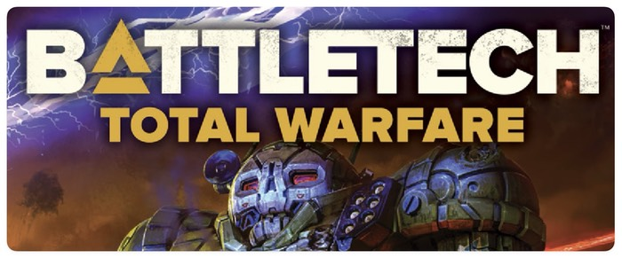
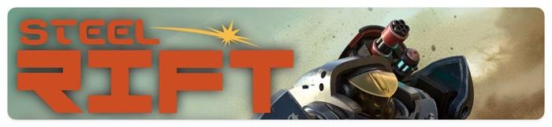

A few days ago I picked up a copy of a new miniature mech combat game called [Steel Rift](https://www.steelrift.com/). The game was developed by [Ash Barker](https://www.youtube.com/guerrillaminiaturegames) of YouTube fame and is sold by [Death Ray Designs](https://deathraydesigns.com). It is an interesting game and I am hoping to try it out soon. The one issue with the rules that I am trying to wrap my head around is the combat resolution system. Specifically, Ash has turned the standard model on its head and assumes that weapon systems always hit and then makes the defender roll to evade/save damage. 

There are some other peculiarities of the system that made me open up a new file in Numbers and start to do some cross-weapon comparisons to try to figure out how the system was developed. I then started comparing the system in Steel Rift to Battletech as we as another 6mm mech combat system called [Horizon Wars - Midnight Dark](https://www.precinctomega.co.uk/post/horizon-wars-midnight-dark-the-pitch). Which leads us to...

## Battletech

[Battletech](https://www.catalystgamelabs.com/brands/battletech) has been around for what seems forever and you can't really discuss mech combat games without including it. Most of what goes on in terms of game design for mech miniature combat games is informed by or in response to it. Battletech can be thought of as the [Advanced Squad Leader](https://mmpgamers.com/advanced-squad-leader-c-2/) [^1]of miniature games. It isn't a difficult to master as a game like [Harpoon](https://admiraltytrilogy.com/harpoon.php) [^2] or [Starfleet Battles](https://www.starfleetgames.com/starfleetbattles.shtml) [^3]but it has an extensive amount of additional systems that can be added to the game. 

Combat in Battletech is a two step process. First, you determine if the weapon hits its target and then you determine where it hits and how much damage it does. The game is very granular. Weapons have short, medium and long ranges [^4] as well damage types and to-hit modifiers for some weapons. 

Battletech uses a 2D6 roll to determine if a weapon has hit its target. The game even has an handy acronym to remember to steps in combat resolution - **GATOR**.

- **G**: Gunnery Skill of the mech's pilot (typically 4 - 6 )
- **A**: Attacker movement modifier
- **T**: Target movement modifier
- **O**: Other modifiers (cover, heat etc)
- **R**: Range modifiers

Players use the Gunnery Skill of the firing pilot and then add movement modifiers, any cover and then range modifiers to come up with a to-hit value. The player needs to roll higher than that on two dice to successfully hit. Values in Battletech are generated on a [Bell curve](https://www.thedarkfortress.co.uk/tech_reports/2_dice_rolls.php) using 2D6 [^7].

| Dice Score | Result or more |
| :--------: | :------------: |
|     2      |      100       |
|     3      |     97.22      |
|     4      |     91.66      |
|     5      |     83.33      |
|     6      |     72.22      |
|     7      |     58.33      |
|     8      |     41.66      |
|     9      |     27.77      |
|     10     |     16.66      |
|     11     |      8.33      |
|     12     |      2.77      |

If the weapon hits then you roll to determine where the target mech was hit and then damage is dealt to that location. Weapons such as autocannons or missile pods need to see how many of the munitions that were fired are on target and then they deal a set amount per munition that hit. Other weapons, like lasers, deal a set amount of damage. 

### Details

The to-hit system in Battletech models three different aspects. The quality of the pilot, the difficulty of attempting to hit a moving target while you are moving and the specifics of the weapon that is being fired. 

#### Pilots

Pilot quality usually ranges from 4-6 with some scenarios having very green pilots with quality values as high as 7. The lower the quality the better the pilot is making it easier for them to put a weapon on target. Pilot quality does become less critical the higher the difficulty of the shot. The difference between a 10 and a 9 (from the table above) is 11.11% but the difference between an 8 and a 7 is 16.67. So unlikely shots are still better odds with a better pilot but average shots are much easier to put on target with a better pilot. 

#### Movement

Movement modifiers are based on the target and attacker movement modes. The attacker modifiers are based on the type of movement the attacking mech made - walking, running, jumping or being stationary. The target modifiers are based on how many hexes (or inches) of movement that the mech made in a turn. The further the mech moved the more difficult it is to hit. An immobile target has a -4 modifier making it quite easy to hit. 

####  Weapons

The core of the to-hit system in Battletech is in the weapon differentiation. 

Here is an example of some of the data for the various Autocannon weapon systems in the game. Battletech organizes them by damage value.

| Name          | Damage | Minimum | Short | Medium | Long  |
| :------------ | :----: | :-----: | :---: | :----: | :---: |
| Autocannon 2  |   2    |    4    |  1–8  |  9–16  | 17–24 |
| Autocannon 5  |   5    |    3    |  1–6  |  7–12  | 13–18 |
| Autocannon 10 |   10   |    0    |  1–5  |  6–10  | 11–15 |
| Autocannon 20 |   20   |    0    |  1–3  |  4–6   |  7–9  |

Each weapon has different damage values but the most critical item are the distinct range values. These values give a weapon a sense of having ballistic properties that require them to be handled differently than other weapons - even similar systems. 

| Name         | Damage | Minimum | Short | Medium | Long  |
| :----------- | :----: | :-----: | :---: | :----: | :---: |
| Large Laser  |   8    |    0    |  1-5  |  6-10  | 11-15 |
| Medium Laser |   5    |    0    |  1-3  |  4-6   |  7-9  |
| Small Laser  |   3    |    0    |   1   |   2    |   3   |

The lasers in the game have varying amounts of energy powering them which make them have more damage but also also them to avoid dissipating due to the effect of the atmosphere thus giving the Laser Laser a much longer range than the Small Laser. The weapons in the game are filled with similar examples where weight, heat and damage are all balanced against range.

### Summary

The challenges when playing Battletech are not only trying to get your weapons to hit the target (or conversely to stop your opponent from hitting your mech) but also to use the weapons on your mech at their most advantageous range. Since a mech will be outfitted with multiple systems it is a battle to maximise the potential damage. You have to fight to put your mech into the most advantageous position while trying to keep your enemy from doing the same. 

All of the parts of the combat system feed into this. You may have poor pilots or have taken damage that has eliminated a weapon system. Your best range may be the same as your opponents. Battletech doesn't focus on one aspect of mech combat but instead tries to create a simulation of combat with multiple parts. Some of which have an immense amount of granularity. 

I have also not mentioned the damage location, armour location and internal structure systems since this article will be quite long as it is.

## Steel Rift

Steel Rift was released in 2022 and is a simpler game system, than Battletech, with a focus on larger, quicker games. Steel Rift is supported by the [mech miniature range](https://deathraydesigns.com/product-category/minis/steel-rift/steel-rift-miniatures/) created and sold by Death Ray Designs. Despite this, Steel Rift is a miniature agnostic game that is closer to the [Alpha Strike](https://store.catalystgamelabs.com/products/battletech-alpha-strike-commanders-edition) large-scale combat game than it is to Battletech.

Steel Rift organizes mechs into four categories [^5] - Light, Medium, Heavy and Ultra. Instead of having distinct weapons like Battletech, Steel Rift has classes of weapons (Autocannon, Laser, etc) which have varying costs based on the size of the mech that they are equipped to. 

| Name        | Damage  | Traits  |  Cost   |
| :---------- | :-----: | :------ | :-----: |
| Auto-Cannon | 3/4/5/6 | Kinetic | 3/4/5/6 |

So an Autocannon in a Light mech does three points of damage and costs three tons of the mech's weight allowance. The same weapon system on a Heavy mech would do five points of damage and take up five tons of space. 

Unlike Battletech, in which you could equip a 100 ton mech with small lasers if you wanted, Steel Rift assumes that larger weapon systems go into larger mechs. It also helps simplify the game as players don't need to know *which* Autocannon a mech has only that it has *an* Autocannon. 

Steel Rift also only has range as a restrictive ability on some weapons. The Particle Cannon has the *Short (18")* ability which restricts it from being fired at targets more than 18" away. Other than that, all weapons in the game are assumed to be able to affect targets regardless of range.

### Hitting things

Combat in Steel Rift is initiated when a player uses an Engage order on one of their mechs. They iterate over each weapon picking a target for each one and then determining the Attack Pool. This is the number of D6s that the target will have to roll to evade later. The Attack Pool starts as the Damage rating for the weapon (see the Autocannon example above) and then is modified based on several factors such as the direction of the incoming fire, obscured LOS or if the target is not the closest one or is different than the first target. 

When a mech fires its weapons in Steel Rift it is assumed to hit. The Attack Pool is the base damage of the weapon modified up or down based on terrain and facing. Once that pool is determined it is assumed to have made it down-range to its target. The defending player then takes a number of D6 equal to the Attack Pool and then attempts to evade them. The roll needed to evade is based on the size of the mech with Light mechs having a base roll of 3 and Ultra Heavy mechs having a base roll of 6. Any dice that fail to evade then damage the target. 

#### An example

A Heavy mech with an Autocannon fires at a Medium mech. The Autocannon on the Heavy has a base damage of 5. The Medium mech has its side arc facing the Heavy so the Attack Pool goes to 6. The Medium mech's player rolls 6D6 and is looking for 4s. They roll  a below-average two and so the Medium mech takes 4 points of damage. This is applied to the Medium mech's Armor rating of 8 to reduce it to 6. If the Armor rating goes to zero then any further damage would be applied to the Structure of the mech.

### Additions

Steel Rift also has upgrades that you can equip mechs with to add shielding to internals, targeting systems, advanced armour and even mine launchers. You can make optical camo shielded light mechs with targeting systems that act as Forward Observers as well as massive, heavily armed Ultra Heavy mechs that require you to get up-close to deliver 'alpha strikes'. 

Once interesting factor in the game's rules is the Kinetic ability of some weapons. This has the potential to alter the facing of a target (especially if the firing mech is a larger size) bringing the side or rear arcs into play. It doesn't come into play that often but it can have quite an impact in some situations. It is a simpler version of Battletech's Pilot Tests that result in a mech falling down. In Steel Rift you can spin around a mech that has been placed to target for a missile boat or even try to stop a target from returning fire. 

### Summary

Steel Rift has a very different approach to combat than Battletech. Ash Barker, the author,  deprioritises movement and doesn't consider it in his calculations. He also assumes that any modern tech that can make walking mechs can also deliver a weapon to a target's general area without much difficulty [^6]. This is one of the various parts of the Battletech system that I have issues with so it is nice to see author's doing something different. And given the low complexity of the Steel Rift rules it wouldn't be difficult to add a -1 modifier to an Attack Pool if the target moved more than 10" if you wanted to.

Any defensive systems a mech might have either limit combat or reduce the Attack Pool. So once the defensive player rolls the dice in the Attack Pool to 'evade' the incoming fire both offensive and defensive modifiers have been incorporated. The roll to evade incoming fire seems odd at first but I think that it follows on from Ash's decision to forgo attack rolls and just assume that fire simply saturates the area of the target. A Light mech can try to find some cover or dodge and an Ultra Heavy mech has little to no chance to avoid it.  

## Horizon Wars

[Horizon Wars - Midnight Dark](https://www.precinctomega.co.uk/post/horizon-wars-midnight-dark-the-pitch) is a miniature agnostic set of rules for 6mm scale sci-fi combat written by [Robey Jenkins](https://precinctomega.podbean.com/) and originally published by Osprey Publishing. Robey took back the rights to the game and released an updated version this year. Horizon Wars is a much different take on mech combat than either Battletech or Steel Rift. It reduces all units in the game to four stats and abstracts all of the possible weapon systems in a mech or vehicle to a single value. 

Unlike Steel Rift, or a less complicated version of Battletech, Horizon Wars includes rules and stats for infantry, armour and aircraft as well as mechs. It covers more of the units in the 'far future' battlescape. It does this by treating every unit in the game in the same manner. The same stats, the same combat system and the same damage resolution system. There are some exceptions, aircraft for instance have some specific systems, but, for the most part, everything in the game is differentiated by the type and size of the miniature.

Horizon Wars lets you purchase units of infantry, armour, mech and aircraft units. Each unit has a type and a point cost. You can then add upgrades to those units to customise them. Each unit is defined by five stats - **P**resence, **M**ovement, **F**irepower, **A**gility and **D**efence. 

### Building a unit

All units have a base point cost. This can be changed by purchasing upgrades for units as well as modifying the stats for mechs and aircraft. 

| Type           | Cost |  P   |  M   |  F   |  A   |  D   |
| :------------- | :--: | :--: | :--: | :--: | :--: | :--: |
| Light Mech     |  22  |  2   |  5   |  4   |  2   |  3   |
| Heavy Mech     |  43  |  4   |  3   |  6   |  1   |  4   |
| Special Forces |  27  |  3   |  3   |  3   |  4   |  2   |

There are quite a few different upgrades available in Horizon Wars - leadership, weapons, defence, utility, mech upgrades, quality, pilots and heroes. Each category of upgrade has four to six options. Upgrade point costs are based, typically, on the stat they affect. So weapon upgrades cost points based on the **F** stat of the unit. 

####  Weapons and weapon upgrades

Horizon Wars subsumes all of the possible weapon systems a unit is equipped with into a single **F** value. The weapon upgrades apply to this single **F** value and don't imply a single weapon or weapon type but a primary effect of the weapon systems combined. The Plasma upgrade reduces the target's **D** value by two. Perhaps the mech has a gigantic plasma cannon? Maybe it has several plasma weapons? Maybe it has some other combination of weapons that combine to give the effect of the Plasma upgrade without being plasma weapons. In Horizon Wars it doesn't matter.  

### Combat

#### Affecting a target

Horizon Wars determines a unit's ability to hit based on three factors: range, cover and target agility. When a unit fires at an opponent the target number is determined by taking the range, in inches, adding the target's **A** stat and then any cover modifiers. So if your opponent's unit is 11" away, has an **A** stat of 2 and is in light cover then your target value is 11 + 2 + 1 = 14.

You then take a number of D12s equal to the firing unit's **F** stat and roll them all. You then try to make groups of dice that total the target value or more. If you roll any 12s then you get additional successes. To complicate the math of this system the defender then rolls a number of D12s equal to their **D** stat. They can then remove any dice from the attacker's pool that match one of their rolls. And if they roll any 12s it will remove an additional success that the attacker rolled. I know of no simple way to determine the odds of this system short of just writing some Javascript or Python code. 

Every success that the attacker gets is applied to the opponent's unit as damage.

####  Fatigue and damage

A unit in Horizon Wars will take damage from combat as well as fatigue. These two are tracked to measure the cumulative effect of enemy fire and how it degrades a unit. Each success that the attacker gets is applied to the unit as damage by lowering one of the four primary stats (**M**, **F**, **D** and **A** ) by one for each success. The total amount of damage is then also added to a Fatigue track. Once the unit has a **D** stat of 0, or if its Fatigue ever meets or exceeds the total of the four primary stats, the unit is Exhausted. It has reached the limits of its ability to fight and will not be able to fight effectively. 

Units can take a Recover order and make a roll to determine how many points of damage it can potentially reduce. Fatigue is never recovered. As the game proceeds units will eventually become combat-ineffective. Even before that, the unit will start to wear down and become less effective. 

### Summary

The system that Robey Jenkins has devised isn't interested in the specific details of weapon systems. It looks, instead, at how the effect of weapon fire is on combat units. This is a trait shared by many game designers that have a military background and is based, I think, on the current models of combat being taught in western military institutions. Does it matter what type of weapon is being fired if the specifics of the armour systems of the target aren't being modelled? Horizon Wars wants you to look at your miniatures and not wonder if it can take fire from 2D6 anti-tank rounds but instead be concerned with how a round of combat impacts its ability to fight back and stay on the table to continue to fight. 

## Meta discussion as a form of summary

Three games on the same(ish) subject but three much different ways of resolving combat as well as three different ideas about what causes a unit to become unviable on a battlefield. 

Battletech has the crunchy simulationist background that demands detailed weapons, armour and structure systems. There was a trend for games in the 80s to lean into the simulation of combat situations. [Panzer](https://en.wikipedia.org/wiki/Panzer_(wargame)) was released in 1979 and is certainly in the same vein as Battletech. A specific weapon system is fired in a specific spatial circumstance and hits a target in specific location. That location then has discrete subsystems that can be damaged. It can be tremendously fun but it can also be slow. 

Steel Rift forgoes the intricate stats and systems and can be said to not want to model anything. The game is aimed at allowing you to paint up some miniatures and have fun moving them around and shooting your opponents. The combat system tries to minimise the number of dice required to resolve a combat by entwining all of the combat modifiers into reductions in the number of D6 rolled. Weapons are assumed to be, at least, on target and large targets have a more difficult time of evading fire.

Horizon Wars looks at how to model the fragility of combat units in a future war environment. It isn't concerned with any of the crunchy details of Battletech. Weapons are the means to abrade and grind a unit until it can't fight. Since Horizon Wars isn't interested in the specifics of weapons or even armour it is much easier to take a collection of figures and plug them into the game. 

Battletech is an interesting game in that it has resisted the design norms of the last few decades and stuck to its simulationist roots. It has also continued to find new fans to keep the game afloat and, especially in recent years, to expand. All three games show how the core intent of the system inform the development of the rules. Battletech is a military simulation in a sci-fi universe that explores the nuts and bolts of combat but doesn't spend much time dwelling on human factors. There are Pilot Skill rolls but no Pilot morale or Company morale. Games of Battletech often come down to the last mech standing. The game also models things that can, at times, be no fun. Your giant mech can take a single shot to the head and be knocked out of action. It is part of the simulation but does it make for a fun game?

Steel Rift wants to rework Battletech to create a hobbyist title. The goal is a fun game that lets you paint and model mech miniatures. It wants some of the detail of Battletech in that it includes a variety of weapons and armour systems but it doesn't want to tie down players with too many rules. It doesn't really try to model anything as much as it wants to distill a mech combat game down to the smallest set of features that are still fun and feel as if they are close to a Battletech experience. 

Since Horizon Wars has no control over what type of figures a player will bring to the table, the author decided to scrap specifics for generic categories that a player could slot their miniature collection into. If you don't know how many weapons a mech has or even if it is a mech then your rules need to provide a framework that lets players create a suitable recreation of what the model looks as if it can do. So without specific details how does the game represent combat? In the case of Horizon Wars it represents the wear on specific systems and troops with fatigue. The damage system isn't necessarily actual physical damage but troops being unwilling to open a turret and fire or too fearful to move from cover.

 

[^1]: 708 pages
[^2]: The book of charts for the game is 43 pages.
[^3]: A mere slip of a thing at 400 pages. Adding all of the expansions and data annexes can take the game to close to 1000 pages.
[^4]: And sometimes minimum ranges. 
[^5]: An expansion adds a new Ultra Light class.
[^6]: The Battletech universe can rip open space/time to make hyperspace jumps but can't make a computer system that can predict steady movement and account for it in a firing plot.
[^7]: A 2D6 system means that the impact of modifiers will often depend on where the value is on the curve. This is one reason why people don't like using them in miniature games.  
