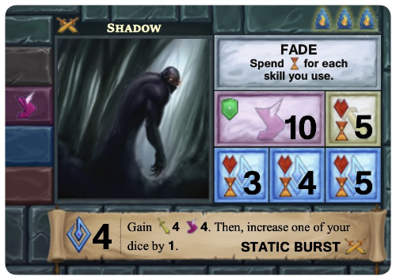

Let me preface this article by saying that this is not a review of _[One Deck Galaxy](https://www.onedeckgalaxy.com/)_. Instead I want to look at the systems in _One Deck Galaxy_, with an aim to describe how they have changed from _[One Deck Dungeon](https://www.onedeckdungeon.com/)_, and how those changes influence how the game plays. I haven't played the physical version of _One Deck Dungeon_, the game that precedes _One Deck Galaxy_, but I have played it on my iPad and Mac. Oddly, ODD it isn't one of my favourite games [^1] but the changes made to the mechanics in _One Deck Galaxy_ have created a much more interesting and strategic experience.

If you want to get a better idea of how One Deck Galaxy plays you can [download a PDF of the rules](https://www.onedeckgalaxy.com/faq.html). 

## One Deck Dungeon

[One Deck Dungeon](https://boardgamegeek.com/boardgame/179275/one-deck-dungeon) was released in 2016. It is a solo/co-operative card game that lets you and a friend delve into one of five different dungeons to try to work your way to the final floor where you confront the dungeons' boss. Along the way you can level your characters up and try to expand your skills and abilities to be better able to take down the boss. 

_One Deck Dungeon_ has a single deck of cards that act as a timer, the unexplored rooms and the monsters or traps in the rooms. On the back is an illustration of a set of closed doors and on the front are the details of the room that the player is exploring. Some are traps. Others are monsters. If the player clears the room they can use the card for experience, a new skill or new abilities. 

At the bottom of the deck is a Descend card that signals that the floor has been explored and that the player needs to go down to the next level. 

So the cards in _One Deck Dungeon_ provide several things:

* a timer to determine when the floor has been fully explored
* new skills
* experience points
* new abilities
* different potions

So there are two tasks that _One Deck Dungeon_ applies to the cards. A basic time-keeping mechanism and a player advancement mechanism. As the game progresses and players use the cards to expand their heroes' abilities they decrease the amount of time that they have for each floor. This isn't a significant issue but it does mean that you go from the final floor to the boss in fewer turns than you had on the first floor. 

## The Basics

[_One Deck Galaxy_](https://boardgamegeek.com/boardgame/256713/one-deck-galaxy/sleeves) builds on _One Deck Dungeon_ to represent a galaxy that you are exploring while you try to expand your Federation of planets. The reason for doing so is one of the five Adversaries [^4] in the game that are attempting to reach their own goal and win the game. Expanding your Federation is how you gain more abilities and dice to enable you to take your Adversary down. 

Your Federation is defined by taking one of five Homeworlds and combining it with a Society. The Homeworld card provides the dice that you will roll each turn, much like the Heroes in _One Deck Dungeon_, and the Society provides the Milestones that you need to complete in order to increase the Level of your Federation. The Federation Level is an important concept in ODG as it is a limit on your ability to attack or slow down the Adversary. 

Unlike _One Deck Dungeon_, _One Deck Galaxy_ puts the card deck into use for several different systems. Despite this there are four fewer cards in the _One Deck Galaxy_ deck meaning that a player will quickly find that the deck is depleted. Far more quickly than in _One Deck Dungeon_

Each Adversary has four tokens on their card. When you succeed at a task on the Confrontation card [^2] you remove one of the tokens. This brings you closer to victory and also inhibits the effects that the Adversary generates to affect you. Each task, after the first, on the Confrontation card requires you to advance a level with your Federation. The final step on the Confrontation card requires that you have your Federation at level 4. How you get to that level depends on the Society that you have picked.

There are five Homeworlds and five Societies giving you a total of 25 different combinations you can play the game with.  Each player also has a Starbase which is used to build fleets and do research. The Starbase is the same for each player but it can be updated three times to provide you with more powerful abilities.

### Influence

The cards in _One Deck Galaxy_ are marked, on the back, with two symbols. These represent Influence. Each card in ODG has a single and double influence token on the long sides of the card. 

The game uses the concept of Influence for several things. It tracks the passing of time, it tracks your power in a Location, it acts as a timer for the Adversary and it also acts as a timer for Encounter cards. It also counts the number of Fleets on your Starbase as well as the Science you have stored. 

So without taking into account the front of the card, the game now uses the back of the cards for:

* overall timer
* Influence tracking for the Adversary
* timer for Encounter cards
* counter for Influence on Locations
* counter for Science
* counter for Fleets

One Deck Galaxy has no set end point, unlike _One Deck Dungeon_, and so burning the deck won't terminate the game [^3] but it may benefit your Adversary and so a player needs to keep an eye on the number of cards they are using to track influence or time. If they don't they may run into problems. 

### The Adversary

The first major change that comes to _One Deck Galaxy_ are the Adversary cards. In _One Deck Dungeon_ each boss was structurally equivalent. They operated in the same fashion with a single skill that would complicate the battle against them. 

In _One Deck Galaxy_ the Adversaries are active. They don't wait at the bottom of a dungeon for you to stumble upon them. Each of the five Adversaries has a set of Event cards, a win condition [^5] and a set of special rules. One Adversary will try to grab Locations and expand faster than you, another is an expanding nebula that swells each turn and slowly leaves you with no Locations to obtain. ODG links the Adversaries into the structure of the game to make them all unique.

### The Discovery Zone

Instead of a dungeon, One Deck Galaxy has the player exploring a galaxy made up of Location and Encounter cards all of which are placed in the Discovery Zone at the centre of the table. This is similar to ODD, with Combat and Peril cards, except that in ODG the Location cards can take more than one turn to clear. It is usually unlikely that you will get enough Influence on a Location to clear it in one turn.

The Encounters get an Influence token added to them each turn. If you do not complete the Encounter after three turns it gets turned into Science and may trigger your Adversary. Unlike Locations, Encounters **must** be cleared in a single attempt. 

### Game turn

The first change between _One Deck Galaxy_ and _One Deck Dungeon_ is the turn sequence. _One Deck Dungeon_ has the player exploring a dungeon but One Deck Galaxy presents the player with an active opponent that has its own phase and cards to play. 

The turn order in One Deck Galaxy is:

* Adversary
* Discover
* Action
* Results

#### Adversary Phase

The _Time Passes_ phase from _One Deck Dungeon_ is part of the Adversary Phase now. The number of cards that you remove each turn depends on the Adversary in play. If you look at the bottom of the Adversary card shown previously you will see that it has the turn order listed on it with icons to serve as reminders for when events or actions related to the Adversary happen. This also shows how many cards are removed each turn. For example, the Neeble-Woober Colony Fleet requires you to flip one card in the Adversary Phase. 

The Adversary Phase is also where you will put Influence on the Adversary as well as Encounter Cards. If there are three Influence on an Encounter then it is removed and the Adversary card is checked to see what occurs. This is called an Escalation. Each Adversary has a different response to an Escalation allowing it to provide a different type of game experience. Adversaries can also have actions that trigger at the beginning or end of the Adversary Phase. 

#### Discover Phase

In _One Deck Galaxy_ the Discovery Zone is refilled with cards each turn. This means that there will always be the possibility of new Encounters coming into play which will help to advance the clock. 

#### Action Phase

During the Action Phase the player places the dice from their Homeworld as well as Fleets, Starbase action tokens and stored Science to try to clear Locations and Encounters from the Discovery Zone. The player can also attempt to clear Adversary Discs from the Adversary card as well as any Events that have been revealed from the deck. 

_One Deck Galaxy_ has a few more ways for a player to modify the results on their dice after they have been rolled. There are Techs which are the equivalent of Skills from _One Deck Dungeon_. The Starbase shows the costs to Calibrate dice by spending Fleets or you can spend Science to get black dice. 

There are several complications in the Action Phase that can alter how you play. One of the first that a player may run into is that some Location and Encounter cards require you to spend Fleets and/or Science. To do so you need to discard the required cards from your Starbase but you also need to use a Starbase disc. The number of them available to you is based on the Class of your Starbase. So you need to try to upgrade your Starbase as well as clear cards from The Discovery Zone. The second, and probably most important, is that removing Adversary Discs from the Adversary requires that you increase your Federation level. This is done by completing Milestones that are listed on your Society card. 

#### Results Phase

After you have placed your dice and spent your Star tokens you then determine the outcome of all of the actions from the Action Phase. You claim any completed Locations and Encounters, remove Adversary tokens and some of the Adversaries also trigger at the end of the Results Phase. Once everything has been resolved you reset the supply of dice and tokens and get ready for the next turn. 

## The Impact

_One Deck Galaxy_ gives you many more things to do and track as ones plays the game. _One Deck Dungeon_ is a game focused on character building and beating up monsters. ODG has several interlocking and concurrent systems that you use during the game which creates an experience that is more akin to a 'tableaux' style game than a dice-building title.

My favourite part of this new game engine is that even though there are now ways for you to use dice that would be unusable, or wasted, in _One Deck Dungeon_ you still have to think about how you are using them and where they go. Once you have truly deemed them surplus you can put them into your Starbase Research Lab but that is still a decision that you need to make. Additionally, the Homeworlds and Societies in the base set present the potential for building combos of Techs that are wonderful when you find them.

### Phases

Each Adversary can have triggers that are based on the phases in a turn. Most, obviously, have some action in the Adversary Phase but by allowing an Adversary to react in the Results Phase or the Discovery Phase the game sets up a different flow and problems for the player. With one Adversary you may not be in a rush to clear Locations from the Discovery Zone but the Hungry Nebula makes you look for opportunities to remove Locations or Encounters to limit the Influnce that the Nebula receives.These phase triggers create an experience that is unique to that Adversary.

### Federation level

Each Society card has a set of tokens marking the player's Federation level and there are exactly four Milestones that you can obtain to move your level from 1 to 5. Those levels limit your ability to remove Adversary tokens but they are also used to determine the effect of some Tech. Some of the Adversaries also use your Federation level to determine if you are overwhelmed and could potentially lose the game. Your rush to increase this level also depends on your Society and Adversary. 

### Discovery Zone

The Discovery Zone is the core of the game. It contains all of the cards that a player is going to interact as they attempt to overcome the Adversary. In most games the way that you interact with the items in the Discovery Zone would be similar from game to game. Encounters have Influence timers that can trigger the Adversary. If that reaction is critical it can force a player to move against cards that they may not want to. Do you clear a Location and take it as a Colony or do you leave it in the Discovery Zone because you can use it to pay for the Hungry Nebula's Swell cost? Even the player's Society can impact the Discovery Zone. The Guardians require the player to Exile colonies to achieve Milestones. 

### Deck milling

This entire series was started by my realisation that I was spending a lot of time determining how many cards I could take from the deck each turn. There are Adversary Event cards at the bottom of the deck and each reshuffle brings one out to be resolved. The card deck reshuffle triggers this but the cards themselves are used for Influence, Science, Fleets and to expand your Federation via new Tech and dice. Compared to _One Deck Dungeon_ there are more ways in which you can mill through the deck and this is a far more precipitous occurrence in _One Deck Galaxy_ than it was in ODD. 

Each Adversary and Federation is going to apply their own conditions on a player's use of the deck. You may need to maintain a large number of Fleets which requires keeping multiple cards out of play. You may have a Discovery Zone with four Encounters in it requiring four to eight cards to track Influence. 

## All systems go

What I like about _One Deck Galaxy_ is that all of these new systems combine to create a game that aims to give you a unique play experience each time you sit down. It is also, importantly, a predictable system. You can see how an Adversary will influence the flow of the game. Being able to work to avoid and negate that influence is another thing. All of the variety in the game is also based on hooking into the Phase structure and the global game values such as the Federation level. There are no meta-game systems or systems that exist outside of the structure that you use as a player. The Adversaries play the same game structure that you do. They are difficult to beat but not because they break the game. It is a system that would appear to make it easier to develop new content (Adversary, Homeworld and Society cards) or at least new content that doesn't require extensive initial testing. 

_One Deck Galaxy_ is a great example of a designer iterating on their existing designs and also how to expose your game system for the benefit of players. 

[^1]: This may be a result of playing the digital version and not an issue with the game itself. I think that the process of moving and manipulating the cards keeps you more involved with the game. The UX in the digital game also separates you from the components so you aren't enmeshed into the entire experience. I like One Deck Dungeon more when I play it on a table with real cards.

[^2]: Which has two sides. 

[^3]: Not necessarily. Depending on the Adversary you are playing it may end the game sooner but only because it will trigger more Adversary events. 

[^4]: Each Adversary has a more difficult version on the back giving you a total of ten to play against.
[^5]: Technically a losing condition for the player.