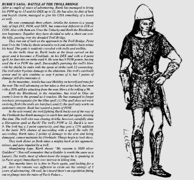
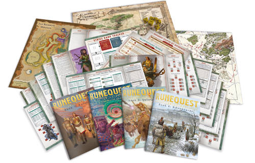
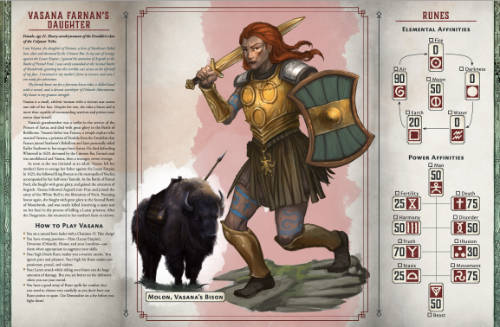
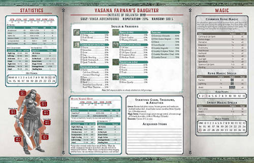

_(Authors Note: the beginning of this is a touch long-winded and not necessarily of interest to everyone. If you want you can [jump to the game recommendations and overviews]().)_

At some point between 1981 and 1983 I found myself with a copy of the RuneQuest Second edition rules, Cults of Prax and Cults of Terror. I literally have no recollection of where I got them. Maybe I found them in a used book store? Or perhaps I purchased them at Spruceland Hobbies [^1] ? Both of them seem unlikely given how remote the city was and how niche the products were.

No matter how I acquired them [^2], they had a profound impression on me. At the time my friends and I were playing D&D, Traveller and, much later, Twilight 2000. RuneQuest was different from all of these other games. It was a more complex system than any of the other games that I played and the rules were deeply intertwined with the setting - [Glorantha](https://en.wikipedia.org/wiki/Glorantha).

> Rurik has become a Rune Lord of the Sun Dome Temple. Having gained a POW of 19 in a recent adventure, Rurik decides to ally a spirit. The cult Priests call, and a spirit of INT 18 and POW 17 appears. Rurik’s total is CHA 14 plus POW 19, or 33. This gives him a 40% chance of allying this spirit, which has a total of 35. He rolls 38, and has gained the spirit Sunfist for an ally. Even had he failed, the spirit would merely have gone away. NOTE: A Rune Lord cannot refuse a spirit his god sends him, even if it is POW 9, INT 3.

You could infuse items with spells, magic power and spirits. The setting had deities, documented in [Cults of Prax](https://en.wikipedia.org/wiki/Cults_of_Prax) and [Cults of Terror](https://en.wikipedia.org/wiki/Cults_of_Terror), that gave worshippers spells and Rune magic that was unique to them.

It wasn't like the standard RPGs at the time. You didn't find magical weapons but you made them yourself. You would sacrifice your POW stat to gain new spells from your deity or store spirits in a piece of jewelry. The "bad guys" in the setting was the expansionist Lunar Empire that seemed to be a more enlightened counterpart to the xenophobic and violent Orlanthi that were the ostensible heroes of the game. All of this was set against a backdrop of a world with a mythology worthy of Bullfinch. The gods were set apart from the world of men [^3] as a result of the attempts of Chaos to destroy the world and all in it.

Finding the game was an epiphany and I have spent my time since then reading and exploring the world. 

## Why play RuneQuest?

Before we look at how to get started playing RuneQuest and exploring Glorantha lets take a moment to explore why you may want to do so. What is it that makes RuneQuest and Glorantha a rewarding RPG experience?

### Setting

The world of Glorantha predates the RuneQuest RPG. [Greg Stafford](https://en.wikipedia.org/wiki/Greg_Stafford) was writing stories about the world in the late 60s and early 70s. He created a wargame, [White Bear and Red Moon](https://en.wikipedia.org/wiki/White_Bear_and_Red_Moon) using those stories as a background, and his desire to have Glorantha feature in an RPG lead to Steve Perrin producing the first [RuneQuest](https://en.wikipedia.org/wiki/RuneQuest) rules in 1978.

Glorantha is messy and very human. The gods make mistakes and occasionally act like spoiled children. They cause disasters, which they often never try to fix. The end of the God Times, and the assault on reality by Chaos, is brought about by the godly petulance. The three Ages that follow are all terminated with a cataclysmic battle between Chaos and the various peoples of Glorantha. 

Chaos, in Glorantha, isn't the opposite of Law/Order as it is in the Moorcock multiverse of the [Eternal Champion](https://en.wikipedia.org/wiki/Eternal_Champion) or even as presented by Games Workshop. In Glorantha Chaos is an existential threat to the very fabric of reality. Chaos will destroy all and the battle against is takes on apocalyptic themes as almost any weapon, magic or god is useful to keep Chaos at bay. 

The deities that populate Glorantha are informed by the mythologies and themes from our world but put into a world where those gods are real and have an actual impact and effect. Societies are informed by their religious beliefs and the desires of their deities and it all coalesces into a "real" world.

### Rules

Normally when someone talks about the quality of the rules for a game or RPG they dwell on the unique features or subtle interactions of systems. RuneQuest is indeed a good set of rules but what makes it an exceptional set of rules is that it in entwined into the Glorantha setting. There is little in the rules that is generic. Chaosium does sell a [more flexible version of the system](https://www.chaosium.com/basic-roleplaying/) that can be adapted to other settings and situations. RuneQuest is only designed to be used to play games set in Glorantha. You aren't playing a ruleset that is used with a setting. You are using a set of rules crafted to make your roleplaying experience in the Glorantha setting richer.

### Roleplaying

Why I think RuneQuest is an excellent RPG experience is that you character and their actions are informed by their social and religious status and obligations. There are no classes in RuneQuest. Your character is a person who lives in a society and has a role in it. That role isn't based on the arbitrary restrictions of a class but on the culture of the society you are in, your religious obligations and your Passions. 

That real-life background also helps to provide a rhythm to the adventuring your characters undergo. They can't spend years and years on the road traveling from dungeon to dungeon. They have positions in a community that they get benefits from. And also people in a community that may be expecting them to provide protection or religious services.

### Isn't Glorantha complicated?

Glorantha has a reputation as being a setting that is made simpler by having an MA in [Bronze Age agrarian economics](https://www.routledge.com/Bronze-Age-Economics-The-First-Political-Economies/Earle/p/book/9780813338774). The setting doesn't require as much work as a Master's Degree but there is a wealth of content available but none of it is really required to play. The Starter Set and the adventures that Chaosium have published all do a very good job of presenting GMs and players with the required background. Chaosium is also working to make sure that all of the background material needed to fully explore Glorantha is in print. No more will you have to dig through used book stores or sell a kidney to buy a copy of an older book from eBay. 

Glorantha **can** be complicated. It just doesn't need to be. 

## The options

Which RuneQuest product you may want to get depends on whether you are an experienced Game Master or not. If you are new to running a game (or the person who will run the game is) then you should look at the [RuneQuest Starter Set](https://www.chaosium.com/runequest-starter-set/). If the person running the game has been a GM in the past then the [RuneQuest Slipcase Set](https://www.chaosium.com/runequest-roleplaying-in-glorantha-slipcase-set/) is the best option for long-term play [^4].

### RuneQuest Starter Set

The RuneQuest Starter Set is one of the few starter sets I have purchased (for RPGs or other games) that is literally packed with material. I am surprised that they even found space for dice. The box contains:

* Starter rules book
* Glorantha background book
* Solo adventure book [^5]
* Adventures
* 12 pregenerated character folios
* Map of Jonstown
* Map of northern Sartar
* Adventure maps
* Reference charts
* dice

The Rules booklet contains enough of the RuneQuest system to run the included adventures. It explains the character stats and skills, combat, magic and also a Spot Rules section to include some items from the main rules that are not required but might come into effect in a game. Things like poison, chases and grappling. The rules don't cover character creation or any skills or spells that you won't encounter in the adventures. The book is very well designed and matches the look and feel of the core RuneQuest rulebook. 

The background book is split between a general overview of Glorantha and a look at the city of Jonstown and the surrounding area. You can read about the history and geography of Glorantha and also learn about the people and places in and around Jonstown where the adventures are set. The city is examined in a good amount of detail. Not too little that you feel uncomfortable bringing players into it but also not so detailed that you feel swamped with information. 

One aspect of Chaosium's publishing plan for RuneQuest that doesn't get enough appreciation is that each adventure book released so far is set in a different area of Sartar. So the Starter Set, [Gamemaster Screen Pack](https://www.chaosium.com/runequest-gamemaster-screen-pack/), [Pegasus Plateau book](https://www.chaosium.com/the-pegasus-plateau-other-stories-hardcover/) and [Smoking Ruin book](https://www.chaosium.com/the-smoking-ruin-other-stories-hardcover/) all detail different areas of Sartar. Combined together you get a very extensive gazetteer to the area without products reproducing material. If you continue to pick up the various RuneQuest adventures you slowly build up an extensive series writeups of NPCs, locations and cities in Sartar. 

As good as the material in the Starter Set is, the highlight of it (at least for players) are the Character Folios [^6].

The pregenerated characters are presented on a two sided sheet with folding edges. When folded the back shows a drawing of the character and the front lists their Rune affinities and a bio of the character as well as suggestions on how to play them. 

And when you open the folio it shows the stats, skills, spells and equipment for the character as well as another small piece of art. It is a great way to help players find a character they would like to play without being either overwhelmed by stats or distracted by them. Players can find a character that appeals to them and then once they have made a decision, they can open the folio and start to explore the character's stats and game specific information. 

The Adventure book contains three adventures -  A Rough Landing, A Fire in the Darkness and The Rainbow Mounds. As benefits a RuneQuest game, none of the adventures are entirely focused on combat [^7]. In some respects they are all focused on mysteries which the players need to solve. Some of these will lead to combat against some rather nefarious and chilling foes. One can be completed without any combat at all. And all of them lean heavily into the Glorantha setting to help introduce players to the details of life in Sartar. 

The RuneQuest Starter Set does a very good job at giving players and GMs a taste of gaming in Glorantha. It is a very good value, has a wide range of pregenerated characters and several adventures that show off the rules and the setting. None of the adventures require a deep understanding of the Glorantha setting so it is also a good starting point for a GM who is interested in the setting. It is also an incredible deal. Priced at $30 US and $40 Cnd, the sheer quantity of material in the box is a steal.

The Starter Set also makes an incredible convention gaming product. With twelve different characters and three adventures you can run each adventure multiple times with multiple different groups of characters to provide a unique experience each time. 

## RuneQuest Slipcase Set

The RneQuest Slipcase Set contains the [RuneQuest Glorantha Bestiary](https://www.chaosium.com/runequest-glorantha-bestiary-hardcover/), the [RuneQuest: Adventures in Glorantha rules](https://www.chaosium.com/runequest-roleplaying-in-glorantha-hardcover/) and the [Gamemaster Screen Pack](https://www.chaosium.com/runequest-gamemaster-screen-pack/) all in one slipcase box. Now it may seem a bit odd to be recommending a slipcase set of books as a starting point for experienced GMs. Especially when the set is priced at $120 US and $165 Cnd. The price is a small discount on the books individually and, this is most important, it allows you to get all three products at the same time. YMMV but I was not able to order the Gamemaster Screen Pack on its own here in Canada as it appears out of stock.

The reason that I suggest getting all three at once is that the Gamemaster Screen Pack not only contains the aforementioned Gamemaster Screen but it also contains:

* reference booklet
* Gloranthan calendar
* seven pregenerated characters
* maps of Apple Lane, Clearvine, Sartar and Glorantha
* Gamemaster Screen
* Adventure book

Given the many tables in the RuneQuest game the Gamemaster Screen is quite useful [^8] but the real gem of the set is the Adventure book. As with the Starter Set, the Adventure Book has three adventures and also information about the city of Clearvine and the lands surrounding it. The _Interesting Areas_ detailed in the book also include several small encounters that can be linked together into a mini-campaign that ends with the _The Dragon of the Thunder Hills_ adventure. The Adventure Book is sprinkled with various details and nuggets of information that can be used to fill in the background surrounding the mini-campaign if you like. 

It isn't an advertised part of the marketing for the GameMaster Screen Set. The mini-campaign requires a bot of work for the GM to do to link all of the elements together. It is a nice touch that Chaosium included the material and also that it lets you discover it as you read. There are small bits of information that you can leave for characters to find that will make their discovery of the different encounters even more rewarding. They will not only have an inkling of how to solve the encounters but they will be immersed in the setting even more.

So taken all together, the RuneQuest Slipcase Set is a big purchase but it gets you the full rules as well as a great series of adventures to play. And if you explore the Starter Set and want to expand your game options the RuneQuest Slipcase Set will not contain any adventure or setting material that was a in the Starter Set. 

[^1]: It was the first hobby store in Prince George that carried wargames, miniatures and roleplaying games. And it appears to have an amazing range of goodies considering how remote Prince George was and how little people knew about the hobby. 

[^2]: Lets just say that they fell into my lap due to the providence of a temporarily benevolent deity. 

[^3]: And Ducks. And Elves. And Trolls. And even a race of intelligent baboons. 

[^4]: In this writer's opinion. 

[^5]: You can also [access this online](https://www.chaosium.com/rq-soloquest-the-battle-of-dangerford/) if you are interested. 

[^6]: Which you can [download from the Chaosium website](https://www.chaosium.com/content/FreePDFs/RuneQuest/CHA4035%20-%20RQ%20Starter%20Set/CHA4035%20RQ%20Starter%20Set%20Pregen%20Folios.pdf). 

[^7]: And no cattle raids at all.

[^8]: Moreso than any I bought for D&D 5e which were almost universally a waste of money. 