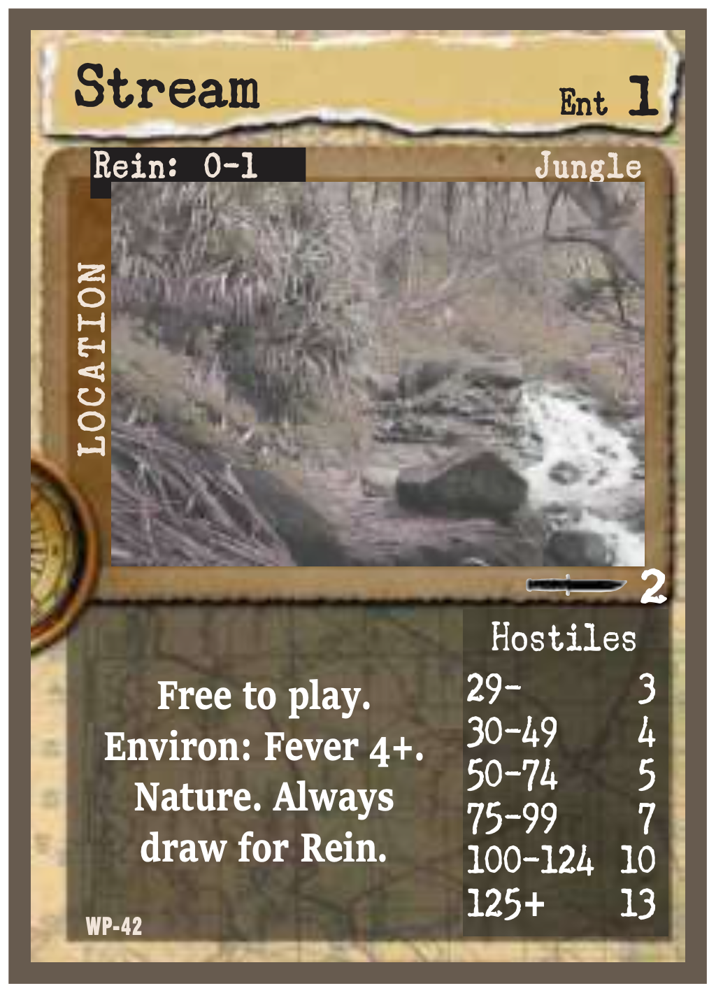
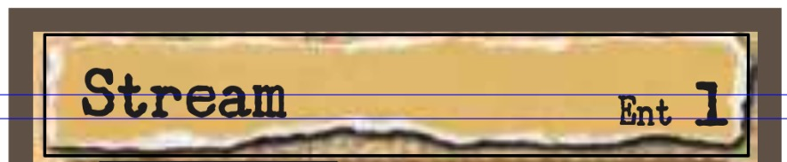
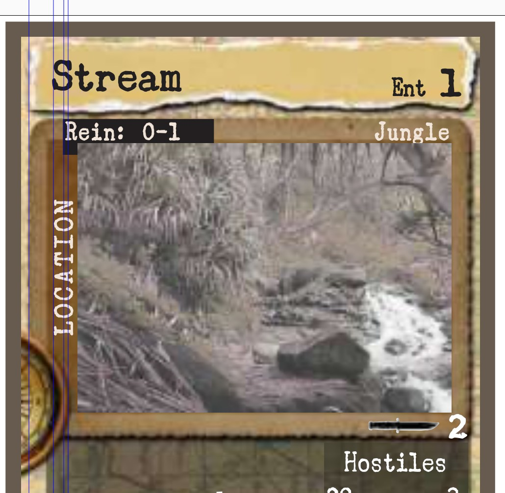
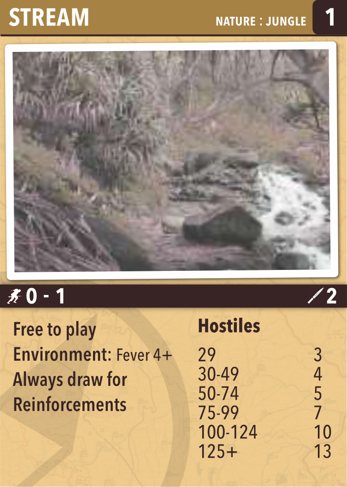
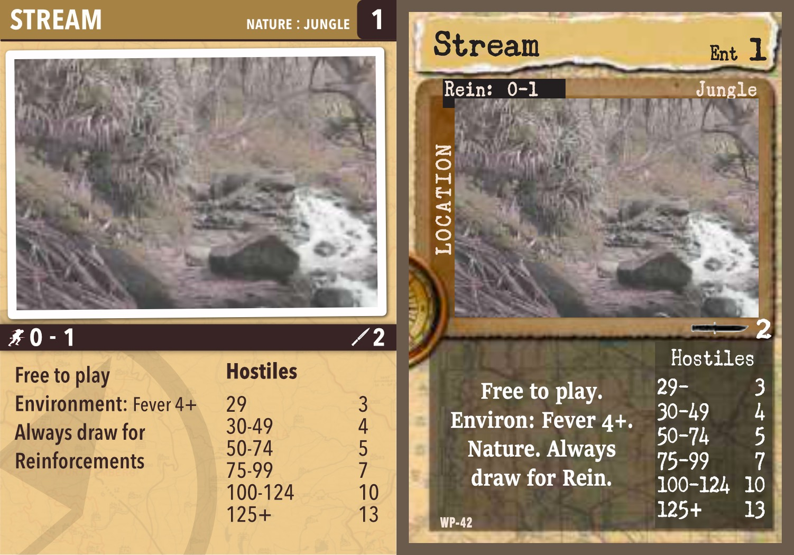

I quite like [Warfighter WWII](https://www.mcssl.com/store/danverssengames/tabletop-games/warfighter-series/warfighter-wwii) card game from DVG Games. It is a simple game that provides for very engaging narrative experiences. There are enough missions, units, enemies, locations and equipment that the game can be played repeatedly with little chance of duplication.

The largest issue with the game, and DVG games in general, is the design. I do not know who the designer for the game was or what constraints they may have been under so I don't want to be too critical. That said, there is much about these cards that could be changed to make them not only look better but also make them easier to use.

## The problem

Before I go into the changes that I would make in the cards it would be useful to have a look at the existing cards and examining the issues I have with them.

This is a sample Location card as it appears in the Warfighter Universal rulebook. There are several different types of cards in the game but they all exhibit the same issues. This card is from the Warfighter: Pacific game. 

### Start at the top

At the top of the card is a bar that contains the Location name and the Entrance cost of the Location. It is positioned over what is meant to look like a ripped strip of paper. The words 'Stream' and 'Ent 1' are at different baselines and have two different sizes of the type. The ripped paper is highly irregular, especially on the bottom, which makes the two pieces of type appear at even more variant heights than they actually are. The 'Stream' text also looks vertically aligned whereas the 'Ent 1' text does not. The ripped edges accentuate this difference in alignment. The irregular edge and shape of the 'paper' makes it difficult to scan from the left to the right. The eye gets drawn in by the tears around the edge. 

### Make it look skeuomorphic 

There is a propensity among wargame art directors to try to make their cards and components look like items from the period of the game.  Skeuomorphism is almost always a bad idea even when an effort is made to use period artwork or type. And when there isn't any real effort to do that, as is the case here,  then it makes the overall design suffer. The ripped strip of paper at the top of the card doesn't imply any real-world item. The border around the image of the stream is another random ripped element. None of it makes any sense and it makes the card more difficult to read.

## Visual alignment

The card has a compass photo on the left side of the card to denote that it is a location but it also includes the text 'Location', in all caps, vertically along the edge of the photo border. The compass on its own is probably more than adequate to inform the user that the card is a location. 

Reading these elements on the card is made more visually confusing as there are four different vertical lines implied by the position of the elements on the card. Five if you count the brown bar that surrounds the 'Location' text.  

The edge of the compass is one, the edge of the 'Stream' text and the 'Location' text is a second and then the black bar that has the 'Rein: 0-1' text is a third. The fourth is the line along the edge of the image border which aligns with the paper scrap on the top of the card. Interesting to note is that the space below the compass has a blank area where the colour from the photo border stops and isn't continued. Or at least that is what you think as you look at the design. The brown bar is meant to be a photo edge but the compass totally consumes the bottom left corner. The eye follows the brown treatment down and then it disappears into the compass. 

## Lost in the crowd without a map

The background of the card is meant to be a map. I think the idea was to add another period element and also to reinforce that the described element on the card is a physical location located on a map. It is a good idea as it indirectly links several themes with a simple visual element. Sadly it is almost impossible to see it. The text areas on the bottom of the card are created using transparent coloured areas to, I can only assume, allow the card to have white text.  Where the map lines really cause a problem is around the photo border and title elements. There isn't enough of the graphic showing for it to look like a map and instead it looks like random noise. 

## Visual language

The card contains several important pieces of game information. There is the entry cost, the location type (Nature), the terrain sub type (Jungle) as well as a close combat cost and a reinforcement limit. All of these items are spread across the card using a variety of design and type treatments. The close combat data uses a visual icon of a knife. Nowhere else does the design use icons and so this stands out from the rest of the card. Highlighting a critical piece of game information is a good thing but it then begs the question as to why icons weren't used elsewhere. 

The important thing about the design of cards, counters or other game components is that if you are consistent with your placement and you explain what each value is then you don't necessarily need to repeat that descriptive information in the design. Once you know where the combat factor is on a counter you don't forget and so there is no need to explain the data on the counter. A consistent visual language makes it easier to learn a game as well as read items from cards or references. 

The card uses abbreviations for items when it is unnecessary. The word 'Reinforcement' is abbreviated to 'Rein:' and this is used on the card, and in the rulebook as well, even though it is not necessary. Why not an icon? If you are going to use an icon for the close combat value then why not add one here? It provides a smaller visual clue to the meaning of the data but doesn't force the use of an unnecessary abbreviation throughout the game.

## Game text

Finally, the main card text is in two different fonts and is placed into areas that are differently sized (and coloured) meaning that the details of the card takes up much more room that the Hostile reinforcement data which is squeezed into a small column. The card details are in a larger size and a different font to create enough visual contrast from the background to make the type legible. None of this is necessary though. The two coloured sections that the type appears on are unnecessary and removing them would make it easier to read the type.

Overall the card is very noisy and difficult to read. The important elements of the card, the game data you need, is spread all over and there are a variety of design flourishes on the card that, at best, add nothing. These are important elements of the game and they need to look better. There are areas of colour but these aren't structural or to differentiate a part of the design but to provide a background for text. 

 Additionally, the 'Nature' and 'Jungle' keywords are better placed at the top of the card where the specifics of the Location are going to be viewed. Those items are important when placing the card in the game and moving into it. They should be together at the top of the card. The Reinforcement value is probably better placed at the bottom of the card. One could make a case for it being at the top but I think that moving it makes the card less unbalanced at the top. 

## A repair

So what do we need to do to try to fix this? The card needs to be easy to read so we need to remove most of the visual clutter. The font used for the card needs to be easy to read and bold enough that it can still be read when placed on a table. Ideally the font would be one that was evocative of the era. Sadly I don't have any such font and the ones that are available are not free so I didn't use any for this project. A good font can make the job of placing a design in a period of time much easier than adding visual elements.

The important game information needs to be easy to read and quick to find. Since the original card already had an icon on it we can look at replacing one, or more, text labels with an icon. We can also try to duplicate the 'military' feel of the card's colours by using similar colours but not quite so many of them. 

### Colour

The new card uses three colours that I captured from the original. Other than the white photo border I have used only those colours on the card. Instead of a nondescript border element I have tried to make the stream image look like a photo. I have also angled it slightly to reinforce the idea of it being a photo placed on the card. 

### Icons

The 'Rein:' text has been replaced with an icon of a running soldier and the word has been fully typed out in the card details. The two keywords for the location, Nature and Jungle, have been moved to the top of the card. The 'Ent' text has been removed and only the entrance cost value remains. This cost is always in the same place on the card so it isn't necessary to tag it with text.

### Simplify

The compass and map visuals have been retained but they have been simplified and made less insistent. I like the idea of both of the visual elements but they need to be far more subdued than they are on the original card. They don't need to be as dark or visually present to perform that task required of them. As well, you can now see that the map graphic is a map and not image noise. The final change is the use of a single font with multiple weights to provide contrast without having to resort to different weights or sizes.

## Comparision

It is interesting to notice that there isn't really a lot of information on the card and when you remove all the extraneous visuals it looks dramatically simpler. 

The two horizontal bars help to break the card into distinct sections. The top describes the qualities of the Location and the bottom contains the game rules and tables needed to play. 

I am not aware of the tolerances that are required for the die-cut to create the cards so in a real-world design the elements that I placed might need to be pushed inwards more. I also have several full bleeds on my redesign and I am not sure if those would work in an actual production design. This was also a quick iteration of a design and there are a large number of areas where this could be fixed. The idea isn't to present a final product but to show the effect of simplifying the design and making it more visually consistent. 
